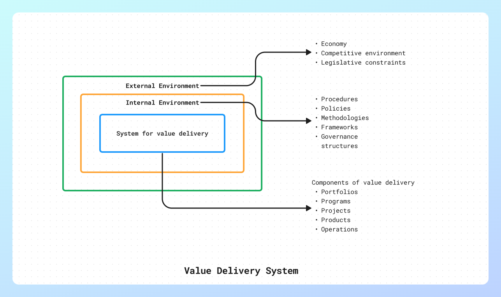
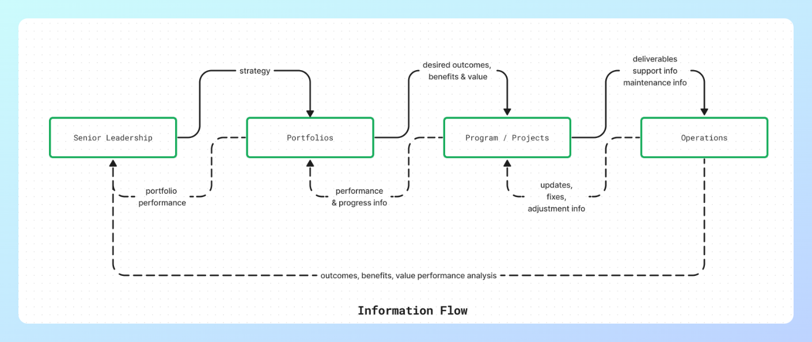

# Project Management - Body of knowledge [PMBOK]

Notes on the principles of PMBOK. SKills essential for managers.
PMBOK is a guide for project management, published by PMI. It has 12 principles and eight domains for delivering project outcomes. It is not a fixed method, but a flexible framework that can be customized and combined with other methods. It helps project managers and teams communicate and work better.

Standard for Project Management
---

### Introduction
* The standard acts as a guide for the actions and behaviours needed to be taken project professionals at appropriate times.
- It provides a basis for understanding PM and how it enables intended outcomes
- is industry,location,size, delivery method agnostic
- describes project operations, governance, functions
- defines relationship b/w project and product management

#### Key terms:
- **Outcomes** : Artifacts, outputs along with value and benefits
- **Portfolio** : Related projects, programs, operations managed as a single entity
- **Product**: Quantifyable component or artifact that is an end item
- **Program**: A collection of related projects that are managed as an entity that provides benefits not available by managing them together
- **Project**: A temporary endevour to provide a product, service or result
- **Project Management**: Guiding projects to intended outcomes using knowledge, skills, tools, techniques and approaches (predictive, hybrid, adaptive)
- **Project Manager**: facilitates project team work and processes
- **Project Team**: 
- **System for value delivery**: Strategic business activities aimed at taking the org forward
- **Value**: Value, worth or usefulness. percieved value is different for different stakeholders

### Value Delivery Systems

#### Creating Value
??? info 
    - **Projects create value for organizations by:**
        - creating a product, service or desired result for end customers
        - societal or environmental positive change
        - improving efficiency, productivity, effectiveness or responsiveness
        - enabling change to help transition to future state
        - sustaining changes from previous programs

    - **Components of value delivery:**
        - Portfolios, projects, programs, products and operations are components of value delivery
        - Working together these components deliver value in line with org strategy
        - Both programs and projects can be standalone
        - Ops can influence and support all the components aling with other functions like payroll
        - Portfolios, programs, projects influence each other as well as ops
        - Components create outcomes (end results) which create benefits which is a net gain for an organization
        - Focus on outcomes, choices, decisions directly proportional to long range performance 

    - The components can be visualized as follows:
        

    - **Information Flow**
        

#### Organizational Governance Systems
??? info 
    - Governance systems work along side value delivery systems
    - They enable smooth workflow, resolve issues and support decision making
    - they provide a framework with functions and processes that guide activities
    - they include elements of oversight, control, value assessment, component integration and decision making
    - provide structure to assess changes, risks and issues

#### Functions of a project
??? info 
    - **Introduction:**
        - People drive project delivery
        - Two main modes of co-ordiation: Centralized (central authority) and decentralized (self-managed)
        - Sometimes hybrid mode of co-ordination also works (central authority with self-managed modules)
        - In either system supportive leadership models, meaningful engagement with stakeholders underpin outcomes
        - The functions in a team will vary depending on lot of factors like deliverables, industry, organization etc.
    
    - **Functions:**
        - *Oversight and co-ordination*
            - Planning, monitoring and control activities
            - Co-ordinating: Collaborating with executive and business leaders to expand on objectives
            - oversight: follow-on activites such as benefits realization and sustainment
            - Fits well with Portfolio and Program functions
        - *Present objectives and feedback*
            - provide insights, perspectives and clear directives from customers and end-users
        - *Facilitation and Support*
            - encourage team member participation, collaboration, shared sense of responsibility 
            - create consensus, resolve conflicts and make decisions
        - *Perform taks and provide insights*
            - people that do the work and produce outcomes and artifacts
        - *Apply expertise*
            - provide knowledge vision and expertise in a specific area
        - *Provide business expertise and direction*
            - prioritizing requirements or backlog based on business value
            - interacting with stakeholders, customers and teams to decide product direction
        - *Provide resources*
            - promote the project and secure resources
        - *Maintain Governance*
            - link between project and strategy teams
            - approve recommendations by teams
            - monitor progress

#### The Project Environment
??? info 
    - **Internal:**
        - Process assets
        - Governance docs
        - Data assets
        - Knowledge assets
        - Security
        - Org culture and structure
        - Staff capability
        - Geographic distribution
        - IT software
        - Infrastructure
        - Resource availability
    - **External:**
        - Marketplace conditions
        - Societal influence
        - Regulatory
        - Commercial databases
        - Academic research
        - Industry standards
        - Financial considerations
        - Physical considerations

#### Product Management considerations
??? info 
    - Product Management involves integrating data, processes, people and business systems to create, maintain & develop a product or service throughout its lifecycle.
    - Forms:
        - Program management within a product lifecycle
        - Project management within a product lifecyle
        - Product managment within a program 

### Project Management principles

- The principles are not prescriptive
- They are broad based to allow multiple individuals and orgs can align to them
- They are internally consistent (one principle does not negate the other)

#### Stewardship
??? info
    - It means taking care, responsible use of resources and upholding values and ethics
    - Two main considerations:
        - Internal:
            - Operating in alignment with orgs values
            - Commitment towards and respectful engagement of team mates
            - Responsible use of orgs resources like finance
            - Appropriate use of authority, accountability and responsibility
        - External:
            - Environment Sustainability
            - Orgs relationship with external stakeholders
            - Societal impact
            - Imapct on the industry practices
    - Stewards have both implicit and explicit duties that may include:
        - Compliance
        - Integrity
        - Care
        - Trustworthiness

#### Collaboration
??? info
    - Collaboration includes multiple contributing factors like:
        - Agreements
            - these are behavioural patterns and working norms
            - they need to be established at the start of the project
            - evolved further to ensure collective working continues
        - Organizational structures
            - Structures that can improve collaboration include:
                - Definitions of roles and responsibilities
                - Allocation of employees and vendors into project teams
                - formal committees tasked with specific objectives
                - Stand up meetings to review topics
        - Processes
            - set of rules that enable completion of tasks and assignments
            - these may include a work breakdown structure, taskboard or backlog
    - By fostering inclusive and collaborative environments, knowledge and expertise are more freely exchanged, which in turn enable better project outcomes.
    - Clearly defined roles can improve project outcomes significantly
    - To clearly define roles the following need to be considered:
        - Authority: Taking decisions
        - Accountability: Owning outcomes
        - Responsibility: obligation for fulfilment
    - A collaborative project team takes collective ownership of all outcomes

#### Engage with stakeholders
??? info
    - Stakeholders are parties that affect, are affected by or percieve to be affected by a decision or deliverable of a program, project or portfolio
    - They influence the project, its performance or outcome (both positive or negative)
    - They affect:
        - Scope / Requirements
        - Schedule
        - Cost
        - Plans
        - Project team
        - Outcomes
        - Benefits realization
        - Risk
        - Quality
        - Sucess
        - Culture
    - Stakeholders will have a varying degree of interest \ influence in the project
    - The engagement level, methodology should be determined based on these factors
    - For example low interest, low influence stakeholders should be engaged in a monitoring capacity and the written communication must be used

#### Focus on Value