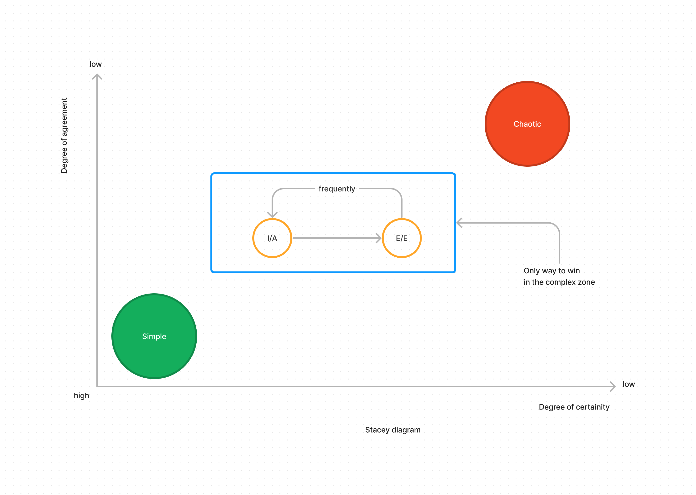
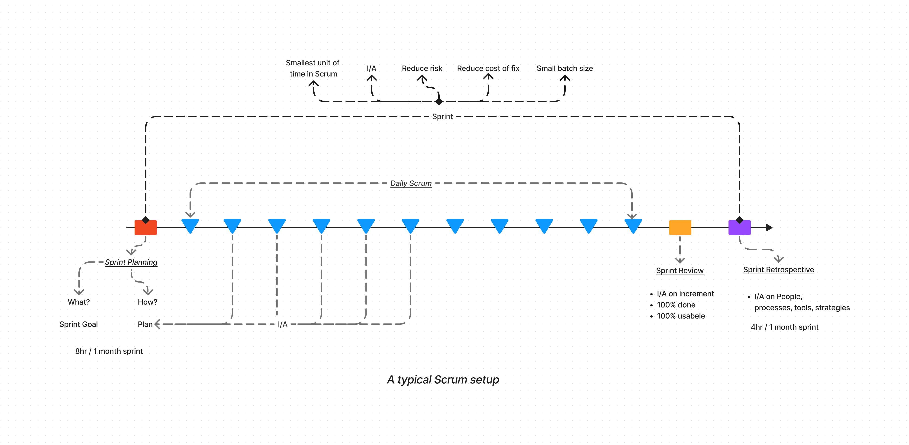
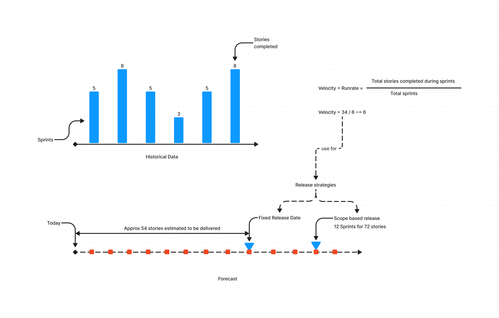
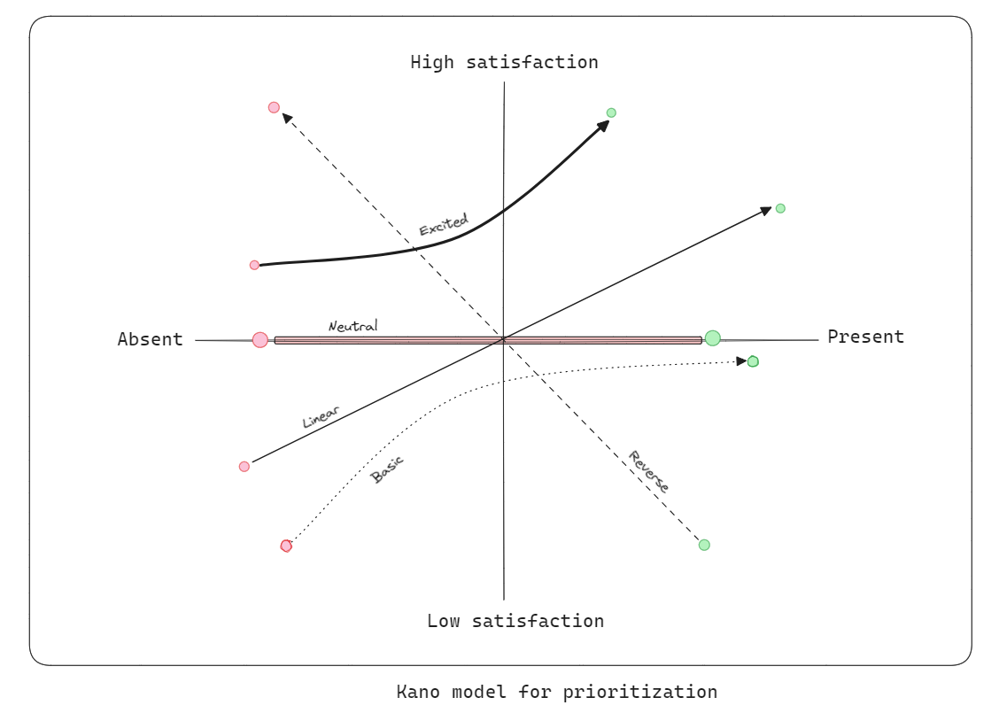

# The SCRUM framework

## Agility Basics

- The concept of Agile can be better understood using a stacey diagram.
- A stacey diagram shows the relationship between degree of certainity and degree of aggreement in a project
- The area in the graph is called a complex zone
- The only way to win in a complex zone is to achieve simplicity and move away from chaos
- Ways to do it?
    - Inspect and adapt
    - Do it frequently
    - Take effective and efficient decisions
- In order to win you need to have 3 things:
    - A framework - Set of basic principles - Example Scrum
    - Strategies - Inifinite - Sprint duration 3hrs
    - Tools and Techniques - Infinite - Jira
- Agile provides a set of values guiding principles for a winning team.
- Typically these are the values that a winning team will value.

[Agile manifesto :material-arrow-top-right:](http://agilemanifesto.org/){.md-button} [Agile principles :material-arrow-top-right:](http://agilemanifesto.org/principles.html){.md-button}

    
## Scrum Fundamentals

#### Scrum Terms

| Scrum Teams | Scrum Events | Scrum Artifacts | Scrum Values |
| ----------- | ------------ | --------------- | ------------ |
| Product Owner | Sprint | Product Backlog| Focus|
| Scrum Master | Sprint Planning | Sprint Backlog | Respect |
| Developers | Daily Scrum | Iteration |Openness |
|  | Sprint Review | | Courage|
|  | Sprint Retrospective | | Commitment|

#### A typical Scrum setup

- The Product backlog refinement happens sometime during the current sprint 
- The goal is to discuss the backlog items in terms of acceptance criteria, value etc.
- The backlog is then ready for the Sprint planning
- Product increment does not mean release
- Release strategy is completely dependent on the PO
- Scrum is an empirical process of Plan, do, check, and act activities

## Tools, Techniques and Strategies

#### Working Agreements

- ==Mutually agreed activities and behaviours== that make us ==achieve our goals effectively, efficiently== as a ==team.==
- Benefits:
    - sets clear expectations from each other
    - accountability for each others behaviours
    - successfully helps working toward a common goal
    - handle conflicts
    - creates effective and efficient teams
- Who:
    - The scrum team can brainstorm on ideas to aggree on activities and behaviors
    - Stakeholders and customers can be consulted for suggestions
- When:
    - To be created immediately when the team is identified
    - Can be updated during sprint retrospectives
- Contents:
    - Values (FROCC)
    - Ways to deal with conflict
    - Activities and behaviors for achiving common goals like continuous improvements
    - Individual commitments 
    - Purpose of the team

#### Common Terminologies

- Definition of Ready:
    - This is a list of items that tells if a PBI is ready to be considered for a sprint
    - This is not a checklist where each item has to be done
    - Examples:
        - All acceptance criterion are discussed and agreed
        - All dependencies and risks are resolved or agreed resolution plan is in place
        - All questions are answered
        - Size of the PBI is small
        - Assumptions clarified
        - Prioritized and ordered
- Definition of Done:
    - List of all items that are needed to qualify an item as 100% done
    - It includes all process, quality related items
    - Evolves over time
    - It is an ideal state that defines the work is done
    - Examples:
        - Coding is complete
        - Quality and functional checks complete
        - Tests added and run
        - Reviews done
        - Documentation done
        - Organization defined quality processes done
- Acceptance Criteria:
    - Mutually Aggreed Solution Statement
    - It defines the functionality that needs implementation
    - Examples:
        - Have a search functionality
        - Show top 16 items to user
- Release Strategy:
    - Defined by the Product owner
    - It describes how, what and when are we release product iterations to customers
    
    Types:

    | Time based - Fixed | Time based - Cadence based | Scope based |
    | ------------------ | -------------------------- | ----------- |
    | The release date is fixed | The release cadence is fixed | The number of features is fixed |
    | 16.12 | Daily, Weekly, Monthly etc. | 75 features |

#### Estimations

- There are 2 types of estimations:
    - Size estimations
        - These use reference points to estimate complexity of a story
        - T-Shirt size : S, M, L, XL...
        - Story points : 1, 2, 3, 5, 8 ...
        - These are non linear estimates
    - Effort estimations
        - Estimates based on time needed to implement
        - These are linear estimates
- Estimation criteria : Scope, Time, Cost, Quality
- Traditional methods of Fixed cost, scope, time and quality work only when we are in the "simple zone"
- Estimations are not commitments
- Modern methods suggest to expect uncertainity and assume atleast 1 is variable
- We need to estimate only the variables and assess the estimate against the risk
- After considering the variables if the risk is in the acceptable zone then we are good to go
- When to estimate:
    - The estimation happens in a Product backlog refinement event
    - The idea is to break down large product backlog items into "SMALL" chunks
    - Small enough to be I/A within the Sprint
    - If the PBI is already "SMALL" then there is no reason to estimate
- Common tools and techniques:
    - Planning poker:
        - Technique of estimation based on Size
        - Team has got PBI to work on which they will estimate using a unit e.g. Story points
        - The prerequisite is there should be a reference story or stories that deem a story to have certain story points
        - And all members should ideally come up with the same story points
- During the Sprint planning only "SMALL" stories must be allowed
- Sprint planning has a layer of estimations \ forecasts as well.
- It includes either one of the two:
    - Capacity based planning
        - Number of hours available vs number of hours required to finish the Sprint goal
    - Historical data based planning
        - Based on historical data how many PBIs have we completed
        - That gives a range of the possible PBIs we can complete
        - Again this is an estimation not committment

#### Velocity

- Ideally if all stories are small they can be given 1 story point
- Assuming this we will consider the velocity concept i.e. 1 story = 1 story point
- We need to calculate velocity by adding all historical story points and finding an average per sprint
- Use this velocity to forecast based on release strategy
- The concept is illustrated below:

#### Kano Model for prioritizations
- The Kano Model is a tool for measuring customer satisfaction. 
- It prioritizes features based on how customers react to their presence or absence.
- The Kano model suggests prioritization based on the effect it will have on the end user
- A graph is plotted between customer satisfaction and future state of the feature
- A line is plotted based on the customer satisfaction levels and the following pattern emerges:
    - Basic expectations : Bare minimum expectations
    - Linear expectations : Keep giving more
    - Neutral expectations : Does not matter if it exists or not
    - Exciting zone : Whoa we were not expecting it
    - Reverse zone : Feature existence is a problem
- The kano graph is illustrated below:

#### Burndown Charts / Burn up charts

