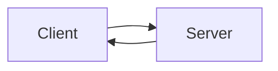
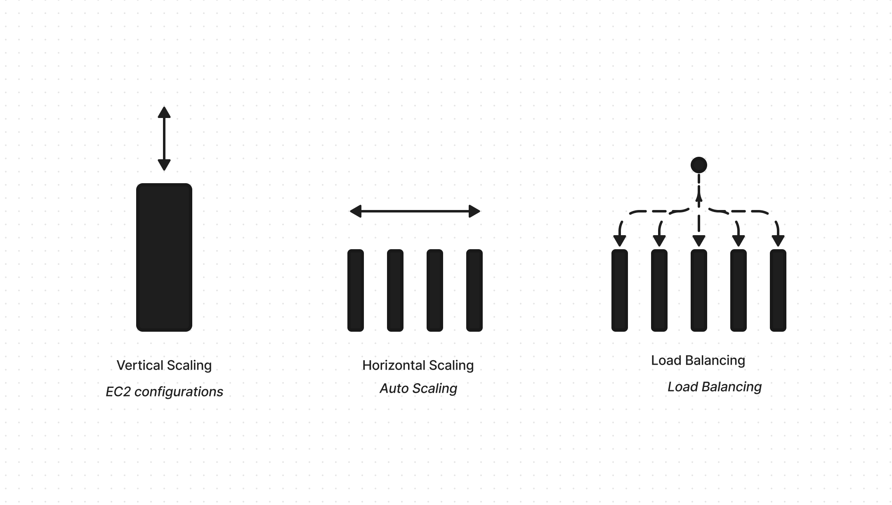
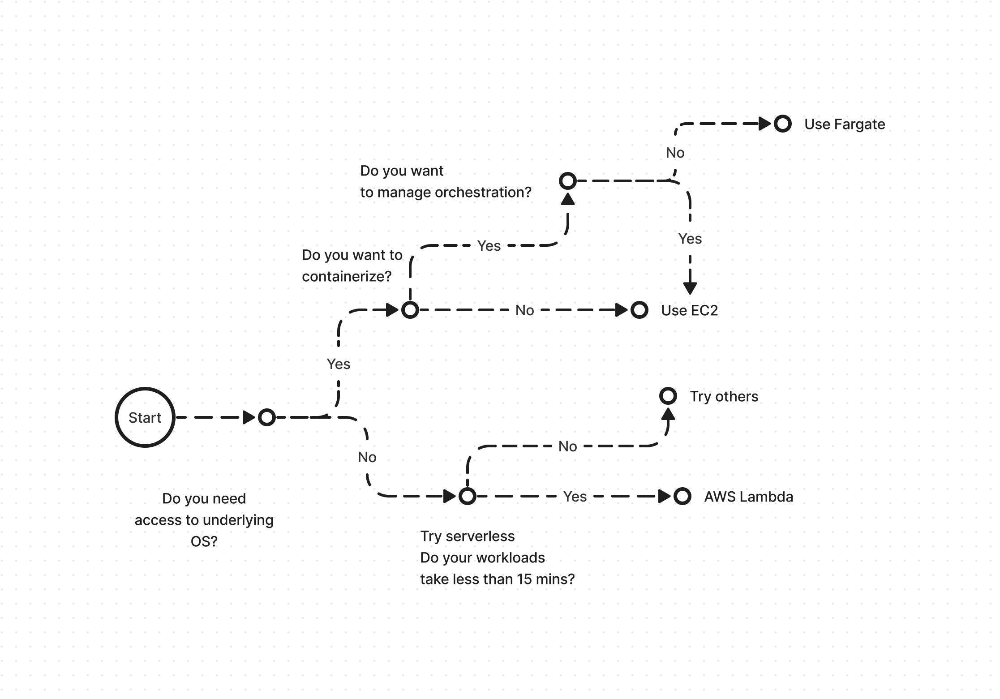
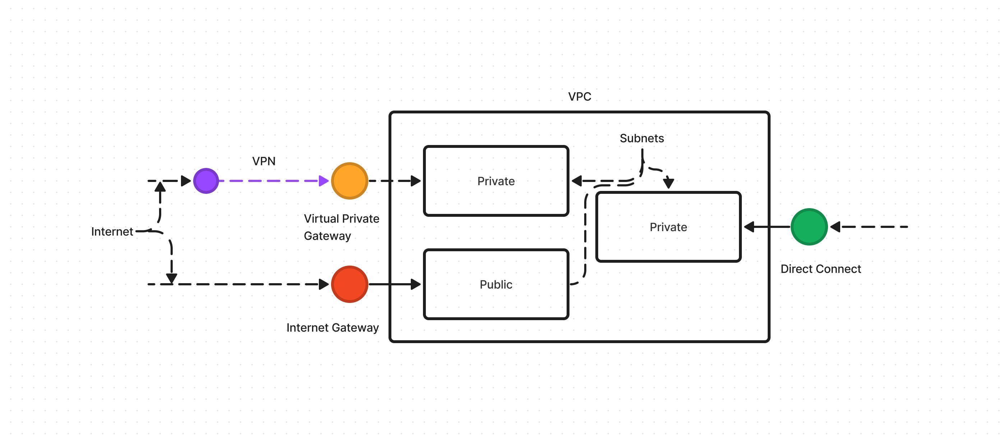
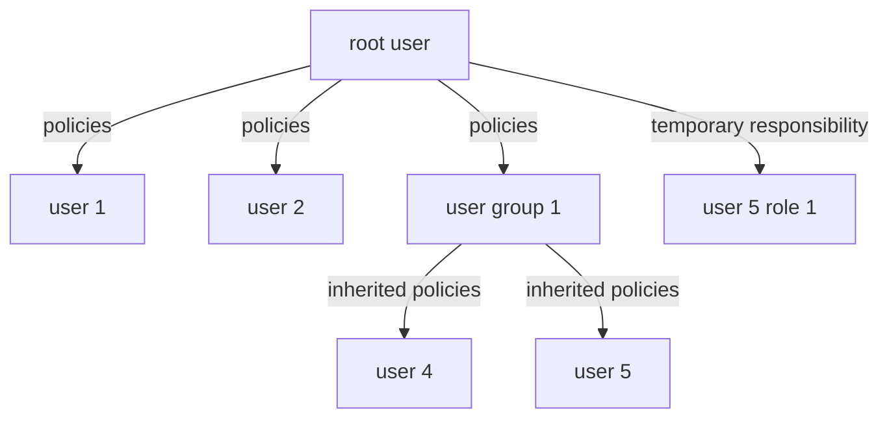
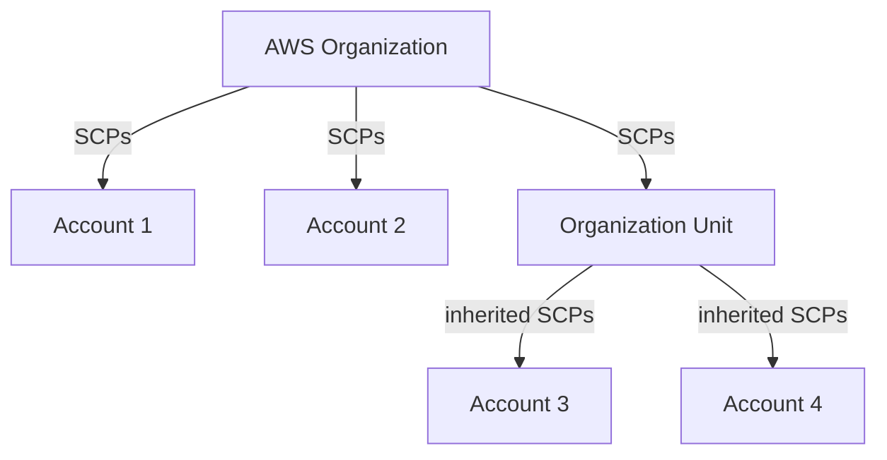

# AWS Basics

## Introduction

- AWS is built on the client server model
- The client for example a web browser sends a request to the server for example a AWS EC2 cluster
- The server returns the information requested
- AWS works in a pay as you go model where you can add or remove resources as needed
    

- Formal definition: *Cloud computing is a ==on-demand delivery== of ==IT resources== over the **internet** with ==pay as you go== pricing*
- There are 3 main types of deployment models:

=== "Cloud"

    - Existing applications are moved to cloud
    - New applications are built in cloud
    - Run all parts of the application in the cloud

=== "OnPremise"
    - Use virtualization and other technologies with own data centers
    - Also called private cloud

=== "Hybrid"
    - Connect parts of current applications to cloud
    - Needed sometimes for better maintenance of the applications on OnPremise
    - Regulatory compliance could also be a factor

    Eg. batch processing automatin is in cloud but all other aspects are OnPremise

- Benefits of cloud:
    - Variable costs over upfront costs
    - No need to maintain own data centers
    - Scale in and scale out based on demand. no guessing
    - Build massive economies of scale. Aggregated use by multiple customers results in low pay as you go price
    - speed and agility
    - Global deployments in minutes

## Compute

- EC2 - Elastic Compute Cloud:
    - These are virtual servers which can be procured on demand instantly
    - Amazon takes care of procuring, securing and enabling them on the internet
    - Makes use of virtualization technology that helps spin up virtual servers
    - A "Hypervisor" helps share resources of the host machine between virtual servers and isolating them
    - This is also called multi-tenancy and is managed by AWS
    - We can choose the following aspects when requesting EC2 instances:
        - OS
        - Number of instances
        - Applications that run on the server
        - Networking preferences - public, private etc.
    - EC2 instances can be vertically scaled i.e. the capacity can be added if application is maxing out the server resources

- EC2 Instance types:
    - Optimization is based on 3 main criterion:
        - Compute
        - Memory
        - Storage

| Type | Optimized for | Examples | Key notes |
| ---- | ------------- | -------- | --------- |
| General Purpose | Balance between all aspects | variety of workloads like app servers, game servers, S/M DBs | useful when compute, memory and storage need is equivalent|
| Compute Optimized | high performance compute | high performace web apps, dedicated game servers, batch processing | Used in cases similar to general purpose but need  HPC |
| Accelerated Compute | Compute + Accelerator | graphics processing, data pattern matching | cases where CPU based compute does not meet requirements |
| Memory Optimized | Memory | high performace databases | Used when CPU processing needs large amount of data to be preloaded | 
| Storage Optmized | Storage | ditributed file systems, warehousing | IOPS = I/O per second. Used when we need high IOPS | 

- Pricing:

| Plan | Notes | 
| ---- | ------------- |
| On-Demand | Useful for unpredictable workloads that cannot be interrupted |
| Reserved Instances | Two types standard and convertible. Can be bought in 1y or 3y terms. need to specify type, size, tenancy, os, availability zone|
| Savings Plan | hourly spend commitment to an instance type and region for 1y or 3y term. Saves 72% as compared to on-Demand |
| Spot Instances | Bid on available resources at AWS for upto 90% off but can be taken away with a 2 min notice |
| Dedicated Instances | Physical servers that are fully dedicated for ones use. Most expensive |

- Scaling:
    - Scaling means starting out with the resources you need and designing your architecture to scale out or in based on demand
    - Automatic scaling process is provided by *Amazon EC2 auto-scaling* service
    - The service has 3 modes:
        - Dynamic scaling: Responds to changing demand
        - Predictive scaling: Schedules resources based on predicted loads
        - Hybrid: Both dynamic and predictive scaling can be used together for faster scaling
    - The scaling happens in a programatic way
    - For auto scaling you need to specify:
        - Minimum requirements: Bare minimum required to run the application
        - Desired requirements: Defaults to minimum if not specified
        - Maximum requirements: Maximum in case of load
        - In either case the charges are per use
- Load balancing:
    - If scaling solves the problem of overloading a single server load balancing solves the problem of distributing the load
    - Elastic load balancing distributes the load based on least amount of outstanding requests
    - The front end only refers to the Load balancer URL and hence decoupled from application servers and are unconcerned about scaling of compute resources
    - ELB is auto scaled as well with no change to hourly rate
    - ELB along with Auto scaling provide high availability and performance

- Messaging Queuing:
    - There are two main types of architectures:
        - Monolithic
            - Tightly coupled
            - When one part fails other parts are impacted
        - Microservice based
            - Multiple independent components that talk to each other
            - Loosely coupled
            - Less prone to failures. Fault tolerant
    - The services that enable communication that in turn enables fault tolerant architectures are:
        - SNS - Simple notification service
            - Pub/Sub model
            - One shot publishing a message, notification, http request to multiple subscribing applications
        - SQS - Simple Queuing service
            - A queue where messages are stored until the recieving application processes it
    - Both of these applications do not require the recieving application to be available
- Other compute products:
    - AWS Lambda
    - AWS Elastic Container Service
    - AWS Elastic Kubernetes service
    - AWS Fargate

    In order to decide which one to consider use the below decision matrix:
    

## Global Infra and Reliability

- AWS ditributes its data centers accross the world and calls it "Regions"
- Each region has multiple data centers and they are all connected with fiber optic connectivity
- This is done to provide highly available and fault tolerant infrastructure

#### Regions

- There are 4 main criterion to consider while choosing a region:
    - Compliance
    - Proximity
    - Feature availability
    - Pricing

#### Availability Zones

- Availability zones are data centers or collection of them physically isolated withing a region
- As a best practice we should have resources deployed in 2 AZs at any time to be fault tolerant
- Any AWS service that is tagged "Regionally scoped service" is automatically regionally highly available e.g. Load balancer

#### Edge locations

- These are locations with cached copy of the application and its data to serve nearby customers
- This is basically a CDN and is called Amazon CloudFront
- The networking is done using Amazon DNS service Route53
- In case the customers need a local copy that is installed in their buildings then use AWS Outposts

#### How to provision AWS resources

How to interact:

- "Management Console"
    - Browser based console to manually manage and monitor resources
- "AWS CLI"
    - A command line utility to script AWS commands and automate the management
- "SDKs"
    - Programming language specific development kits to automate the management

How to provision:
    - Using the interaction tools
    - Elastic beanstalk
        - EC2 based tool
        - Takes code and desired configuaration and inputs and builds the infrastructure
        - Provides visibility as well
    - AWS Cloud formation
        - IaC tool
        - Can be used with a host of services not just EC2
        - Uses text based configuration files to build resources
        - Less prone to error

## Networking

#### Virtual Private Cloud

- VPC is essentially a private network inside AWS
- Inside the VPC services can be arranged based on the requirements in buckets called subnets.
- There are 2 possible subnets:
    - Public 
    - Private
- Considering 3 possible scenarios based on requests:
    - Public requests to AWS cloud via open internet
        - Use internet gateway
        - E.g. Users requesting access to our site
    - Private requests to AWS cloud via VPN over open internet
        - Use virtual private gateway
        - Data center connections, internal users contacting the network via a VPN
    - Private requests to AWS cloud via a dedicated network
        - Use AWS direct connect
        - This reduces network costs and increases bandwidth
        - Data center connections routed via direct connect locations and connecting via virtual private gateway

    

#### Network ACLs and Security groups

- The access to VPC is granted by gateways.
- But this only secures the perimeter
- The subnets inside the VPC are accessed via the network access lists (Network ACLs) of the gateway
- These are stateless firewalls which allow or deny access to the subnets based on a list
- The default ACL allows all inbound and outbound traffic
- Custom ACLs can be used to decide security on this level
- Once the packets are inside the subnet the EC2 instances need a security layer on their level as well
- This is called a Security group
- These are stateful systems that allow or deny packets to the EC2 instances
- Security groups are implicit deny which means only the allowed traffic is let in

#### GLobal networking

- When a customer tried to connect to say a company website it uses a DNS resolver
- The DNS resolver translates the request to an IP address and allows the connection to the website
- Amazon has Route 53 to provide DNS resolution
- It helps connect infrastructure inside and outside AWS as well
- It has certain strategies to achieve DNS resolution:
    - Geolocation based
    - Geoproximity based
    - Latency based
    - Weighted round robin
- Another service that provides Global networking is Amazon CloudFront which is a CDN

## Storage and Databases

#### Block storage
- EC2 instances have associated block storage but they are ephemeral and data is tied to EC2 lifecycle
- To solve this problem amazon provides EBS or Elastic block storage
- These can be provisioned as per size needs and attached to EC2 and the data persists
- EBS allows to take regular snapshots of data so that disaster recovery is possible
- These backups are incremental i.e. only the data that is changed is backed up
- Stores data in an Availability zone

#### Simple Storage Service
- Amazon stores the files as objects
- An object is the file itself, metadata and a key
- These objects are stored inside buckets (think folders)
- Maximum size of the object is 5TB
- Durability: 99.99999999%
- The objects can be stored in multiple tiers namely:
    - S3 standard
    - S3 Infrequent Access
    - S3 one zone Infrequest access
    - S3 Intelligent tiering
    - S3 Glacier Instant retrieval
    - S3 Glacier Flexible retrival
    - S3 Deep archive
    - S3 outposts
- Amazon also provides lifecycle policies that can control the tiers based on usage and number of days for example

#### EBS vs S3
- If you have a single file where you need to do micro edits choose EBS
- If you have large files that need to be dealt with as discrete objects then use S3

#### Elastic File System
- True managed Linux file system
- The system supports multiple read and write connections
- Scales automatically
- Regionally scoped. EBS is AZ scoped
- On-premises can access data using Amazon Direct connect

#### Relational databases
- AWS supports relational databases to be installed on EC2 servers
- Supported databases:
    - PostgreSQL
    - Oracle
    - MySQL
    - MariaDB
- This is typically called lift-and-shift
- That way all of the current database activities and variables are available from the cloud
- It automates tasks such as hardware provisioning, database setup, patching, and backups.
- However, if we need a more managed approach then we can use Amazon Relational database System or RDS
- Amazon aurora is fully managed professional database system in the cloud
- It supports PostgreSQL and MySQL and provides the service at 1/10th the cost of other offerings
- It replicates six copies of your data across three Availability Zones and continuously backs up your data to Amazon S3.

#### Amazon DyanmoDB
- Dynamo DB is a fully managed serverless (no need to provision, patch or manage servers) database
- It is a non-relational and no-sql database specifically a key-value database
- It stores data as items and attributes
- It also has millisecond response times
- It is purpose built i.e. it only suits a certain work loads

#### Amazon Redshift
- Managed data warehousing solution
- Warehousing is used when we try to answer the question "what happened"
- Used for big data analytics and BI analytics workflows

#### Amazon Data migration service
- Used when:
    - migrating onPremise data to cloud
    - production to dev and test database
    - consolidating databases
    - continuous replication
- Can be used to move data from different databases as well
- For example OP MySQL can be migrated to Cloud PostgreSQL
- The source database does not stop during migration and can still be accessed

#### Additional databases

| Service | Type | Use | Remarks |
| ------- | ---- | --- | ------- |
| DocumentDB | Database |  User profiles etc | MongoDB workloads |
| Neptune | Database | Social network, fraud detection | Graph database |
| Quantum Ledger | Database | compliance Audits | Immutable database entries |
| Elasticache | Accelerator | comes in redis and memcached flavours | improves fetch from databases |
| DynamoDB accelerator | Accelerator | | improves DynamoDB fetches |

## Security

#### Shared responsibility model

- Security of the cloud - Owned by AWS
    - Physical infrastructure
    - Servers
    - Hypervisors
- Security in the cloud - Owned by the customers
    - OS
    - Applications
    - Data

#### Identity & Access Management

- AWS provides a variety of options to control the access to the platform and its services
    - Root User:
        - Has access to everything
        - Best practice is to add MFA as soon as 1st login
        - Create new users based on tasks and assign permissions and use the created users to do tasks
    - Users, User groups, policies:
        - Root can create users and add them to user groups
        - The activities they can perform are governed by policies
        - Policies define the activities users or user groups can perform, resources they can access 
    - Roles:
        - Allows users to assume temporary responsibility and do tasks

#### AWS Organizations
- AWS organizations is a service that allows grouping and managing AWS accounts 
- It allows to set SCPs (service control policies) on individual accounts and group of accounts (Organizational units)

#### Compliance
- AWS has a shared responsibility model
- It completes part of the compliance requirements on its own
- The services and data built on top of AWS the compliance needs to be done by the company
- They can use the compliance functionality themselves or use the exisitng features in AWS
- All compliance reports can be accessed via "AWS Artifacts"
- Compliance center is a one stop solution to get all information related to compliance requirements for various use cases

#### DDos

- A well architected system is already capable of handling some types of DDos attacks
- For example, security groups and ALB can take care of UDP flood and SLow loris type attacks
- AWS Shield is a service that can be used to protect against sophesticated attacks
- It has 2 modes:
    - Standard
    - Advanced
- It has a WAF web application firewall that takes care of the bad actor signatures and has ML capabilities

#### Additional services
- KMS - Key management systems that provides encryption at rest and transit
- Inspector - Regular security scans
- Guard duty - Proactive threat detection with continuous monitoring

## Monitoring and Analytics

#### CloudWatch
- Amazon cloudwatch collects metrics from host of services and helps show them in one place
- It allows to set alarms based on data points to trigger actions

#### Cloudtrail
- Making changes to the system in AWS is API driven
- Cloudtrail helps to identify changes based on these API calls
- It records who, what, when, how aspects of the change for effective audit
- CloudWatch Insights is a service we can use to detect unusual activity and get alerts

#### Trusted Advisor
- Web service that provides information based on best practices of using AWS
- It provides information on 5 pillars:
    - Cost Optimization
    - Performance
    - Security
    - Fault tolerance
    - Service limits
- Useful to avoid high costs and optimize for best use

## Pricing and Support

- AWS offers free tier which are either forever free, 12 month free or limited trial free types
- Pricing model is either:
    - Pay per use
    - Reduced pricing for commitment
    - Redeuced pricing for volume based usage
- AWS has a billing dashboard where you can view MTD view of the resource usage
- You can also check Billing info
- AWS offers consolidated billing for users of AWS Organizations
- They can get simplified billing, share premium savings features withing accounts and the service is free
- AWS provides a way to create budgets based on actual or forecasted usage and set alerts
- Its called AWS Budgets
- AWS cost explorer lets you analyze the past data for cost.
- You can create a dashboard and filter by tags to analyze the data
- AWS offers support in the following tiers:
    - Basic - Free - limited trusted advisor checks 
    - Developer - Basic + best practice guidance etc.
    - Business - This and above includes AWS Trusted advisor
    - Business On-Ramp - This and above includes TAM (Technical Account Manager)
    - Business Enterprise
- AWS Marketplace lets you search for tools and apps built on AWS for 1 click solutions

## Migration and Innovation

## Cloud Journey

