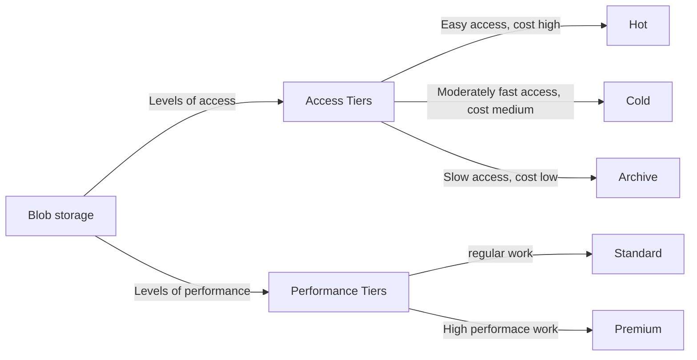
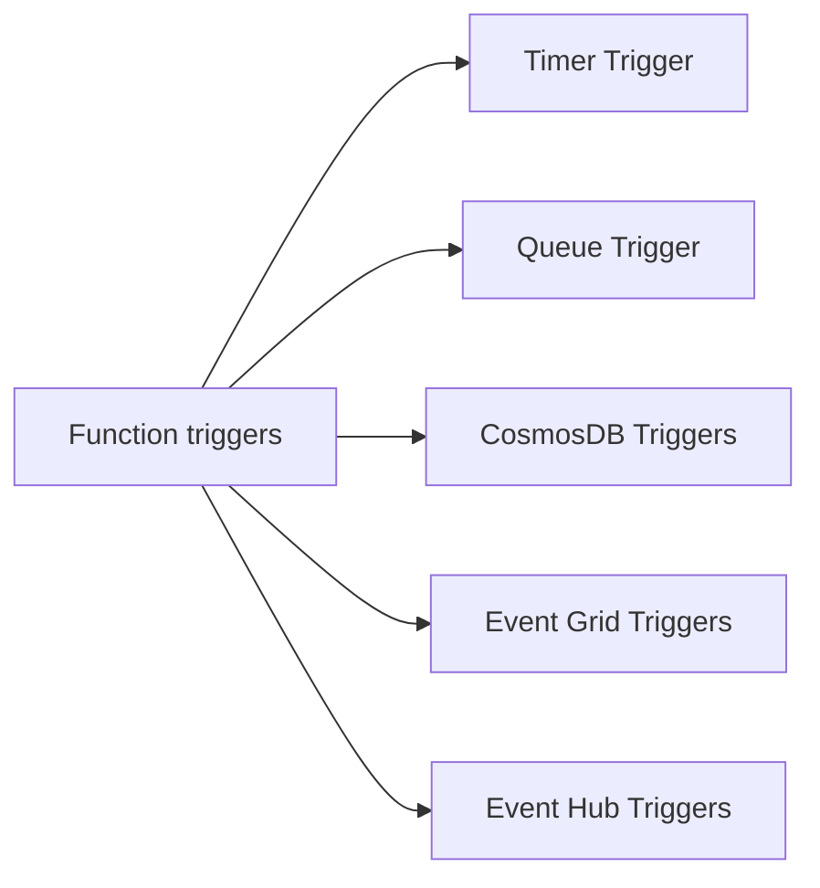
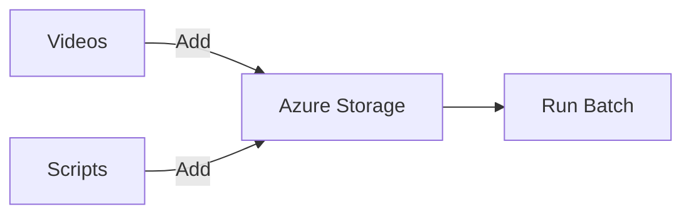

# Azure Practioner

## Core Azure Concepts

- Azure Subscription
    - Its basically an account where all your services will be stored
-Resource groups
    - Its basically a bucket in which you can store your services
    - Logically grouping them and providing permissions as needed
    - Two resource groups cannot share a resource
- Tagging
    - Allows to tag services by a name
    - The tags can be based on application or departments etc
    - Very nifty when analyzing usage
- Azure Resource Manager
    - API based resource manager
    - The management can be done in a few ways viz.:
        - ARM templates
        - Azure portal
        - Azure CLI
        - Azure via powershell (windows only)
    - Use ARM templates for IaC requirements
    - Use Azure portal for visual management
    - Use Azure CLI when ARM templates get complicated and need better declarative scripts
    - Use Azure CLI for building cross platform scripts
- Azure Regions and Availability Zones
    - Azure offers multiple regions accross the globe
    - Most regions have something called as a Region pair which can be used to introduce redundancy to the system
    - While choosing a region consider the following:
        - Region closest to your current data center if giving up OnPremise 
        - Region farther away from your current data center if keeping the OnPremise setup
        - Region closer to your majority user base
        - Region in the middle of your majority user base to provide same latency to all
    - Each region has 1 or more availability zones
    - Each availability zone is a collection of 1 or more data centers
    - These provide fault tolerance by making use of fault and update domains
    - AZs are separated physically
    - AZs along with Region pairs customers can have lots of redundancy introduced in the system

## Azure App Services

- Azure App service is basically an instance where you can host your application code
- The application may include Rest APIs, mobile backend etc
- It supports a limited number of languages like:
    - .Net
    - Java
    - Python
    - C#

## Azure Storage

- Storage
    - Storage is a service which allows to store unstructured data like images, videos, documents etc.
    - It comes in 2 flavours:
        - Blob storage
            - Used to store large images or videos
            - Or in cases where media needs to be available over https
            - Or in case there is a need for backups
            - Cheaper than file storage
        - File storage
            - Primarily used in cases where existing applications use SMB protocol and the whole application cannot be re architected
- Blob storage details


- Cosmos DB
    - Cosmos DB is Azure No-SQL offering and comes in many flavours
    ```mermaid
    graph LR
    A[CosmosDB] --> B[Document]
    A --> C[Key-Value pair]
    A --> D[Wide Column]
    A --> E[Graph]
    ```
    - It supports multiple access APIs like Cassandra API and Mongo API
    - Its not a replacement for SQL server unless the application is largely refactored

- Azure SQL Databases
    - Deployed or managed SQL servers in the cloud

    ```mermaid
    graph LR
    A[Databases] --> B[Hosted infrastructure]
    A --> C[Managed SQL]
    ```
    - Deployment options:
    ```mermaid
    graph LR

    A[Single Databases]
    B[Hyperscale Databases]
    C[Serverless Databases]
    D[Elastic Pool]
    ```

## Azure Functions

- Azure Functions work in the same way as AWS Lambda
- These are serverless applications and we just need to provide code, trigger and configuration
- Azure functions need to be hosted in a Function app
- Function app needs the application to be coded in one language
- Azure functions can be created as a file or in some cases the files are autogenrated using annotations

Triggers:



- Complex function workflows can be implemented in a cleaner way with Durable function


## Batch

- Azure batch is used when we need to perform the same operation on a large number of objects
- For example a social network want to compress videos uploaded to their app
- Here we need to follow the following:


## Kubernetes and Containers in Azure 

- Azure Kubernetes Service
- Azure Container Registry


## Securing Applications

- Authentication is the process of proving the identity based on some factors
- Authorization is the process of determining wheter an action is allowed to do by a user
- Authorization happens after authetication
- Azure provides ways to authentic identity using some identity providers which is the recommended way to deal with identity
- Authorization can be:
    - Role based
    - Claims based - more flexible and recommended

Azure Key Vault:
- Similar to AWS KMS
- Stores keys and other sensitive information
- Integrates with other aspects of the eco system as well

## Monitoring Applications

- Azure Monitor helps track telemetry data and gain insights on the application use
- It gets the data in 2 formats: metrics and logs
- The data can be analyzed reactively using the logs or metrics
- Azure monitor can also help set alerts based on usage

Application Insights
- Application Insights provides usage information of the deployed service
- We only need to add the package to our code and it starts collecting and aggregating metrics for us   

## Optimizing your applications


- Azure Redis
    - Redis cache based service from Azure
    - It supports multiple caching strategies like cache aside, expiration, user-session caching etc.

- Azure CDN
    - Uses inteligent routing
    - Image compression
    - Ability to geo-filter requests


