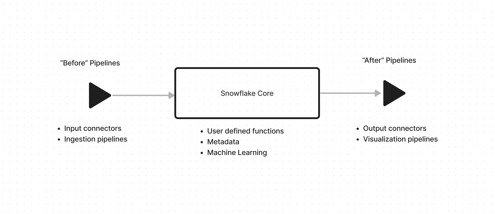
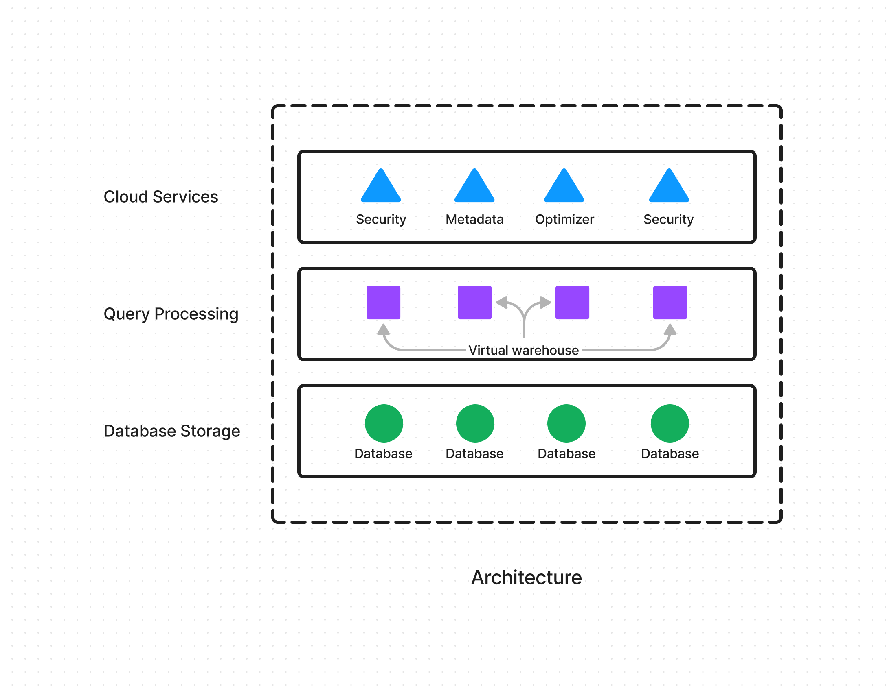
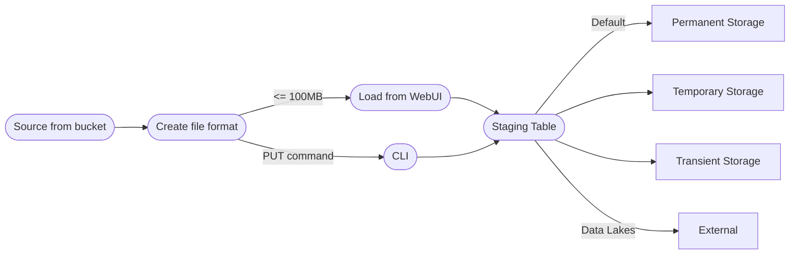

# Introduction to Snowflake DB

## Overview

- Snowflake DB is a cloud-native SaaS data platform
- It provides data platform services with 0 install requirement
- It connects to all major cloud providers
- Uses columnar storage and follows a STAR schema
- Provides ways to aggregate data as well (average, sum, min, max etc.)

#### Snowflake Data platform

#### Date warehouse vs Data lake

| Data Warehouse | Data Lake |
| -------------- | --------- |
| Structured Data | Unstructured Data (files) |
| Tables | Stored as objects |
| Schema on read | Schema on read |
| Huge Volume | Massive Volume |

- Data Lake house is a mix of these concepts

#### Snowflake - Data warehousing analytics solution

| Used for | Not Used for |
| -------- | ------------ |
| Ad-hoc reads | OLTP |
| Data ware house reads | Transactions |
| Data lake reads | Constraint enforcement |

- Key features:
    - Virtual, multi-cluster warehouse
    - Time-travel and zero copy cloning
    - Data sharing and marketplace
    - High availability - cross cloud replication
    - Granular security and automatic encryption
    - Strong support for JSON

#### Snowflake tools

The tools used to interact and use Snowflake:
    - Web UI and console
    - SnowSQL - Python based CLI
    - Snowpipe - Streaming based ingest
    - Drivers and SDK for other languages
    - Partner connections

## Snowflake Storage

- Snowflake storage is:
    - On cloud blob storage or file storage
    - Scalable and available
    - Encrypted
    - Compressed
    - Auto-partitioned

- Ways to load data:
    - External Table
    - Copy command
        - Large single shot copies
    - SnowPipe object
        - Micro copies. continuous entries

- Data load process:

