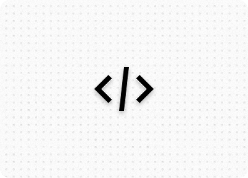

---
hide:
    - navigation
    - toc
    - path
---

# Home

### Welcome to Codex!

This site is a mix of multiple concepts. It serves as my personal digital garden, portfolio and a blog.
It will be a home to a host of information on a variety of topics.

- 👉 If you like the content shared here please give me a shoutout on your social media platforms.
- 👉 Follow me on twitter for more updates

To start exploring just pick a topic that interests you from below:

---
#### The high levels topics are:

!!! info inline ""
    
    ---
    ### Development
    *All things related to software development* 
    
    [Explore ↗](Development/index.md)

!!! info inline ""
    
    ---
    ### DevOps
    *All things related to DevOps*

    [Explore ↗](Management/index.md)

!!! info inline ""
    
    ---
    ### User Experience
    *All things related to User Experience*

    [Explore ↗](Management/index.md)

!!! info inline ""
    
    ---
    ### Technologies
    *All things related to Technologies*

    [Explore ↗](Management/index.md)

!!! info inline ""
    
    ---
    ### Agile Methodologies
    *All things related to Agile Methodologies*

    [Explore ↗](Management/index.md)

!!! info inline ""
    
    ---
    ### Management
    *All things related to Management*

    [Explore ↗](Management/index.md)

!!! info inline ""
    
    ---
    ### Tools & Techniques
    *Some interesting tools and techniques*

    [Explore ↗](Management/index.md)

!!! info inline ""
    
    ---
    ### Miscellaneous
    *Uncategorized free range interesting content*
    
    [Explore ↗](Management/index.md)

